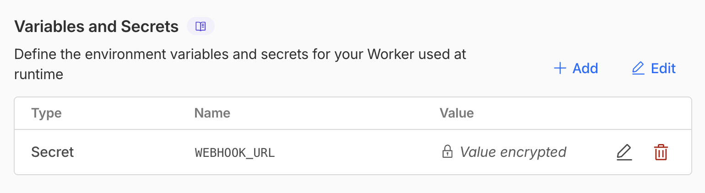
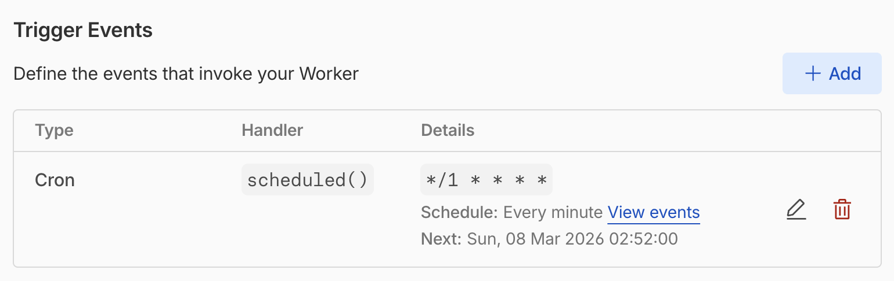

# Project 1: Hello, Workers!

The Workers runtime is designed to be JavaScript standards compliant and wherever possible, it uses web platform API.

In this project, you'll be introduced to Workers and other capabilities it provides.

## Activity 1.1 - What's in a Request?

```javascript
export default {
  async fetch(request, env, ctx) {
    console.log('Request URL:', request.url);
    console.log('Request method:', request.method);
    console.log('Request headers:', Object.fromEntries(request.headers));
    
    // Log Cloudflare-specific request properties
    console.log('Request CF properties:', request.cf);
    return new Response('Hello World!');
  },
};
```  

<details>

<summary>Reference</summary>

* [Runtime APIs](https://developers.cloudflare.com/workers/runtime-apis/) - Explore the Workers runtime
* [IncomingRequestCfProperties](https://developers.cloudflare.com/workers/runtime-apis/request/#incomingrequestcfproperties) - Cloudflare-specific properties like `botManagement`, `colo`, `latitude`, `longitude`, etc.

</details>

## Activity 1.2 - Hire a Cron: Jobs on Autopilot

### Step 1: Update your Worker code with the code below

```javascript
export default {
  async scheduled(controller, env, ctx) {
    console.log('Scheduled event triggered');
    console.log('Cron pattern:', controller.cron);
    console.log('Scheduled time:', new Date(controller.scheduledTime));
    
    // Set this in your Worker environment variables
    const webhookUrl = env.WEBHOOK_URL;
    
    ctx.waitUntil(
      fetch(webhookUrl, {
        method: 'POST',
        headers: { 'Content-Type': 'application/json' },
        body: JSON.stringify({
          message: 'Scheduled task executed',
          timestamp: new Date().toISOString()
        })
      })
    );
  },
};
```

### Step 2: Add environment variable

* Grab your webhook URL from https://webhook.site 
* From Cloudflare Dashboard, go to your Worker app > **Settings** > **Variables and Secrets** and add the environment variable `WEBHOOK_URL` with the value from webhook.site:



### Step 3: Configure cron trigger

* From Cloudflare Dashboard, go to your Worker app > **Settings** > **Trigger Events**  > **Cron Triggers**  > Set the Workers to run every 1 minute:



### Step 4: Let's test it out!

In `webhook.site`, you should see a request coming in every minute.

### Step 5: Manually test scheduled handler (Optional)

This can be tested *locally*:

* In Workers project folder, run the server locally: `npx wrangler dev --test-scheduled`
* Manually invoke the scheduled event: `curl "http://localhost:8787/__scheduled?cron=*+*+*+*+*"`

<details>
<summary>Reference</summary>

* [Scheduled events](https://developers.cloudflare.com/workers/runtime-apis/scheduler/) - Using Workers for scheduled jobs
* [Cron triggers](https://developers.cloudflare.com/workers/configuration/cron-triggers/) - Guide on configuring cron triggers
* [Other Handlers](https://developers.cloudflare.com/workers/runtime-apis/handlers/) - Other handlers: email, queue, etc.

</details>

## Activity 1.3 - Thou Shalt Not Pass!

> 📌 Thou Shalt Not Pass Challenge
> 1. `https://ctf.orangeflare.app` is an endpoint that returns an image only if the request is successfully authenticated.
> 2. It only accepts the following request header values: i) `x-workshop-origin` with value `kai`, ii) `Authorization` with value `asdf1234`   
> 3. Your objective is to retrieve the image from https://ctf.orangeflare.app by sending the request via a Worker.
>    Refer **Instruction** on how to start.
> 4. Once you successfully retrieve the image, share with us the 5 characters you see on the image.

### Details of challenge

1. Create a new Worker project using the following code template:
    ```javascript
        export default {
          async fetch(request, env, ctx) {
            const targetUrl = 'update-this-value'; // TODO#1: Update value
            
            const ctfRequest = new Request(targetUrl, {
              method: 'POST',
              headers: {
                // TODO#2: Update header name
                'update-header-name': env.WORKSHOP_ORIGIN, // TODO#3: Don't update the value here. But, use Workers > Variables & Secrets
                'Authorization': `Bearer ${env.SECRET}`, // TODO#4: Don't update the value here. But, use Workers > Variables & Secrets
              },
            });

            try {
              const response = await fetch(ctfRequest);
              
              return new Response(response.body, {
                status: response.status,
                headers: {
                  'Content-Type': response.headers.get('Content-Type') || 'image/png',
                  'Cache-Control': 'public, max-age=3600',
                },
              });
            } catch (error) {
              return new Response(`Failed to fetch: ${error.message}`, {
                status: 500,
                headers: { 'Content-Type': 'text/plain' },
              });
            }
          },
        };
    ```

2. There are 4 areas marked with `TODO` in the code for you to solve. Deploy Worker for those changes to be effective. 

3. Repeat making changes and deploying Workers until you get the image.

4. Once you do, share with us the **5 characters, highlighted in orange** that you see on the image.

<details>
<summary>Reference</summary>

* [Workers Examples](https://developers.cloudflare.com/workers/examples/) - Various examples of using using Workers

</details>